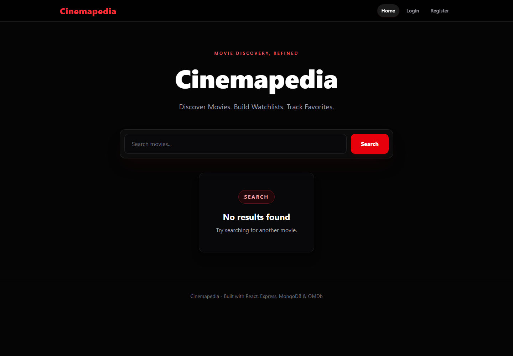
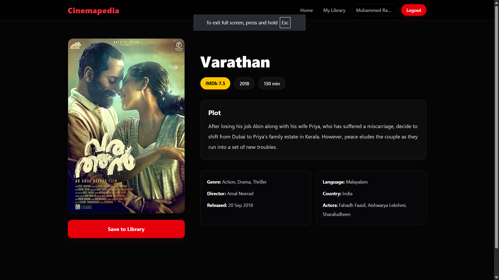
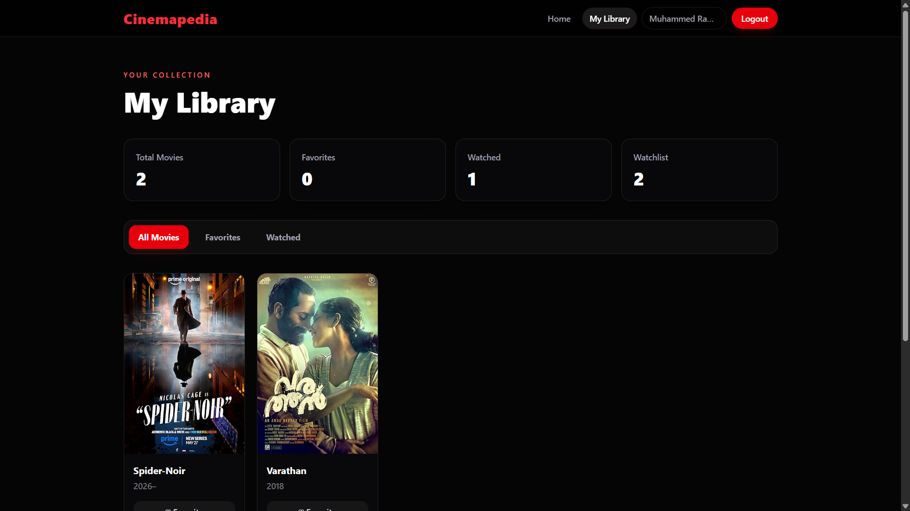
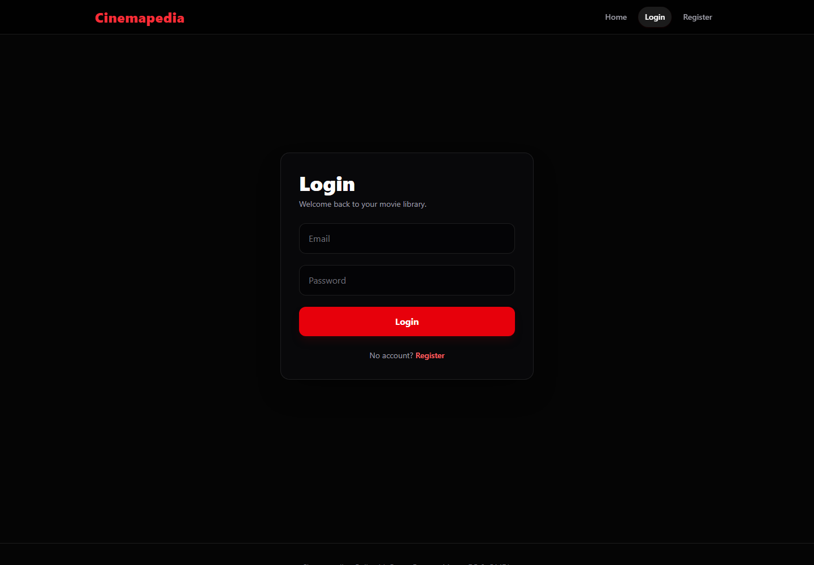
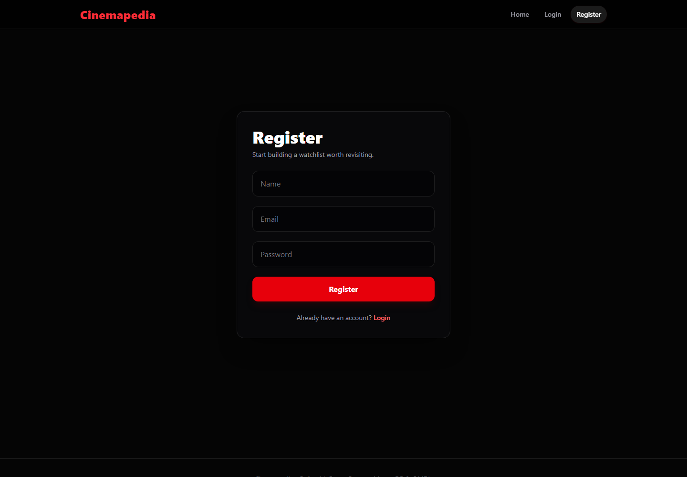

# 🎬 Cinemapedia

A full-stack movie library application built with React, Express, MongoDB, and JWT authentication.

Users can search movies, view detailed information, maintain their own personal movie library, mark favorites, track watched movies, and rate movies.

---

## 🚀 Live Demo

Frontend: **https://cinemapedia-mocha.vercel.app/**

Backend: **https://cinemapedia.onrender.com**

---

## ✨ Features

### 🔍 Movie Search

* Search movies using OMDb API
* View detailed movie information
* Responsive movie cards

### 👤 Authentication

* User Registration
* User Login
* Password hashing with bcrypt
* JWT authentication
* Protected routes

### 📚 Personal Library

* Save movies to library
* Mark favorites
* Mark watched movies
* Personal ratings
* User-specific libraries

### 🎨 UI/UX

* Responsive design
* Dark theme
* Hero section
* Loading states
* Empty states
* Protected pages
* Modern Tailwind UI

---

## 🛠 Tech Stack

### Frontend

* React
* React Router DOM
* Tailwind CSS
* Axios

### Backend

* Node.js
* Express.js

### Database

* MongoDB
* Mongoose

### Authentication

* JWT
* bcryptjs

### API

* OMDb API

### Deployment

* Vercel
* Render

---

## 📂 Folder Structure

```bash
client/
│
├── components/
├── pages/
├── services/
├── App.jsx
└── main.jsx

server/
│
├── config/
├── controllers/
├── middleware/
├── models/
├── routes/
└── index.js
```

---

## ⚙️ Environment Variables

### Server

```env
PORT=5000
MONGODB_URI=YOUR_MONGODB_URI
OMDB_API_KEY=YOUR_OMDB_API_KEY
JWT_SECRET=YOUR_SECRET_KEY
JWT_EXPIRES_IN=7d
```

### Client

```env
VITE_API_BASE_URL=YOUR_BACKEND_URL
```

---

## 🔮 Future Improvements

* Better loading animations
* Enhanced search experience
* Movie recommendations
* Watch history

---

## Screenshots

### Home



### Movie Details



### Library



### Login



### Register



---

## 👨‍💻 Author

**Muhammed Ramzin P**

B.Tech Information Technology
CUSAT School of Engineering

GitHub: https://github.com/Ramzin007
